# E-Commerce Microservices Platform - Architecture Diagrams

## 1. High-Level System Architecture

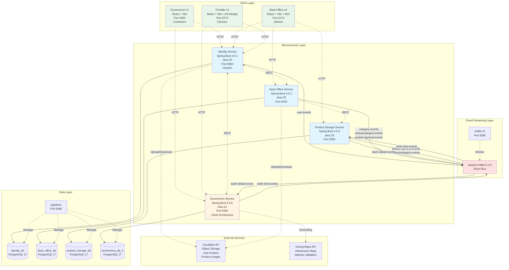

## 2. Event-Driven Communication Flow

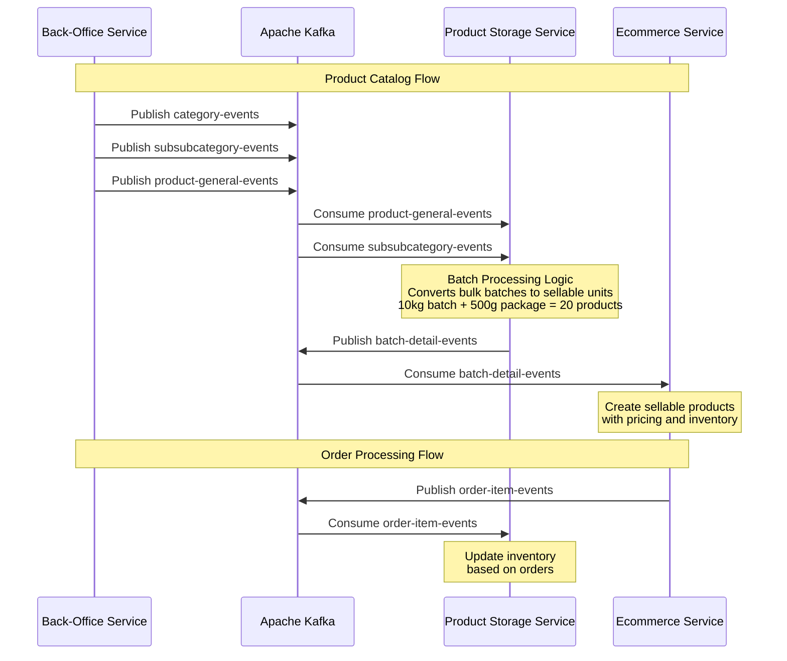

## 3. Kafka Topics and Event Flow

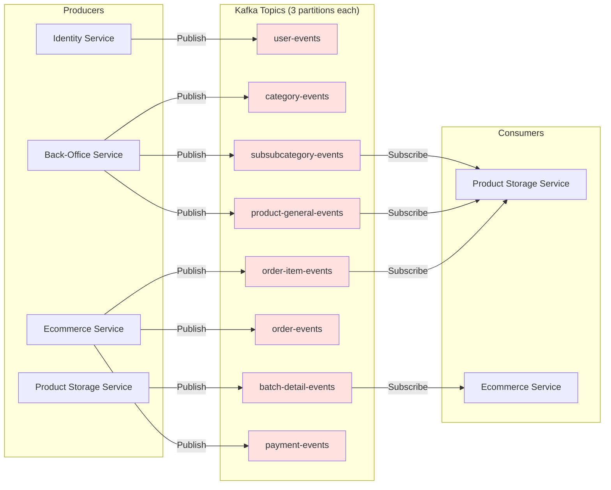

## 4. Database Architecture (Database-per-Service Pattern)

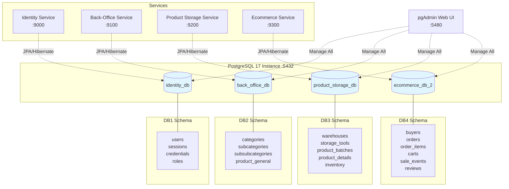

## 5. Service Internal Architecture Comparison

### Identity/Back-Office/Product Storage Services (Layered Architecture)

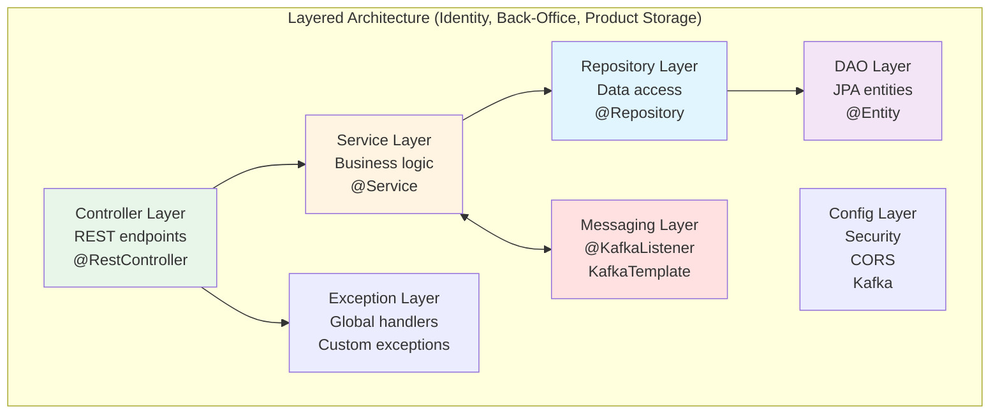

### Ecommerce Service (Clean Architecture)

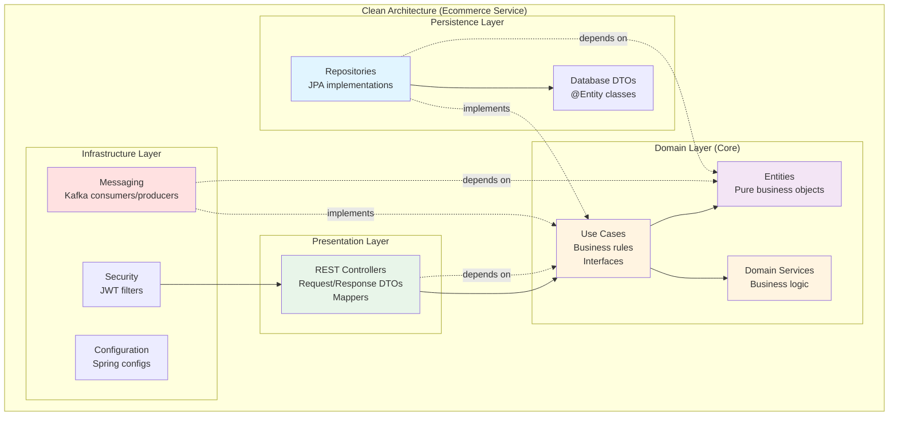

## 6. Frontend-Backend Integration

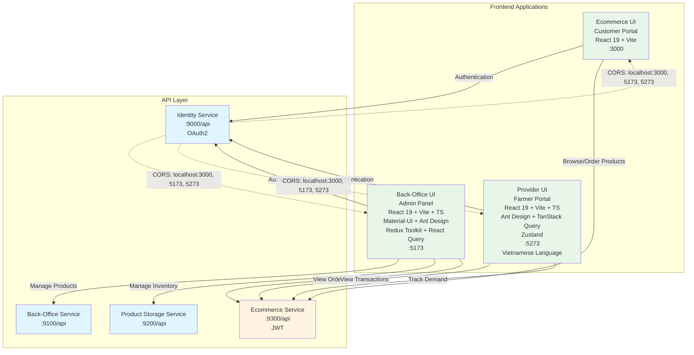

## 7. Docker Compose Deployment Architecture

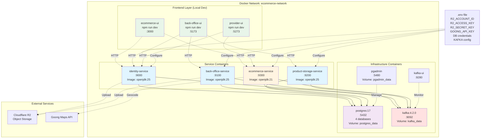

## 8. Service Dependency and Startup Order

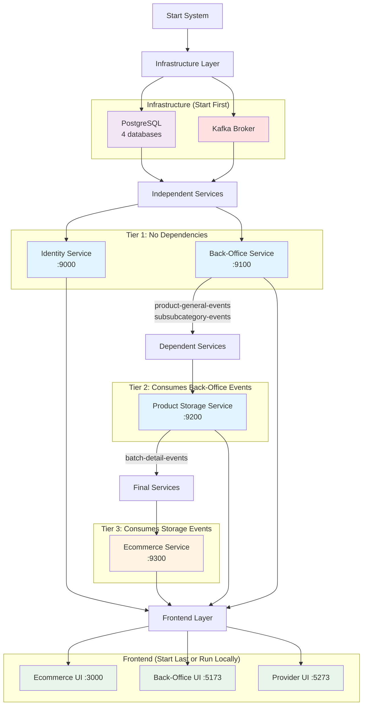

## 9. Category Hierarchy and Data Flow

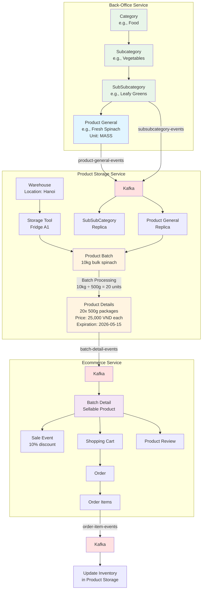

## 10. Authentication Flow

### OAuth2 Flow (Identity Service, Back-Office Service, Product Storage Service)

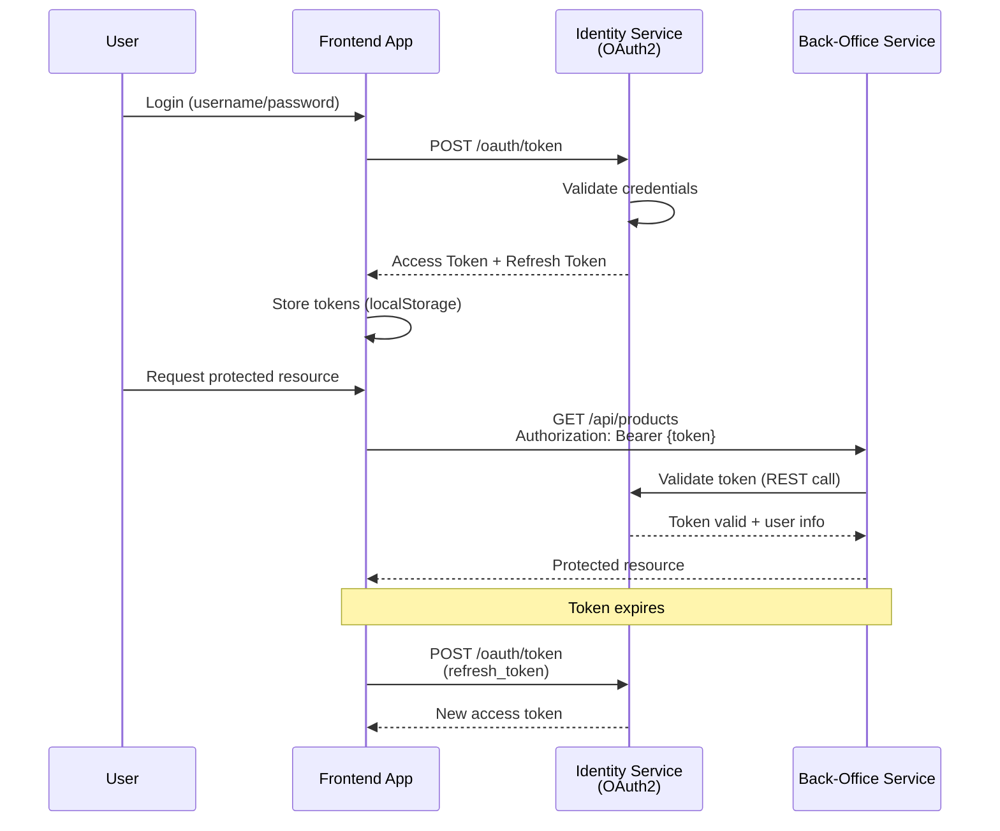

### JWT Flow (Ecommerce Service)

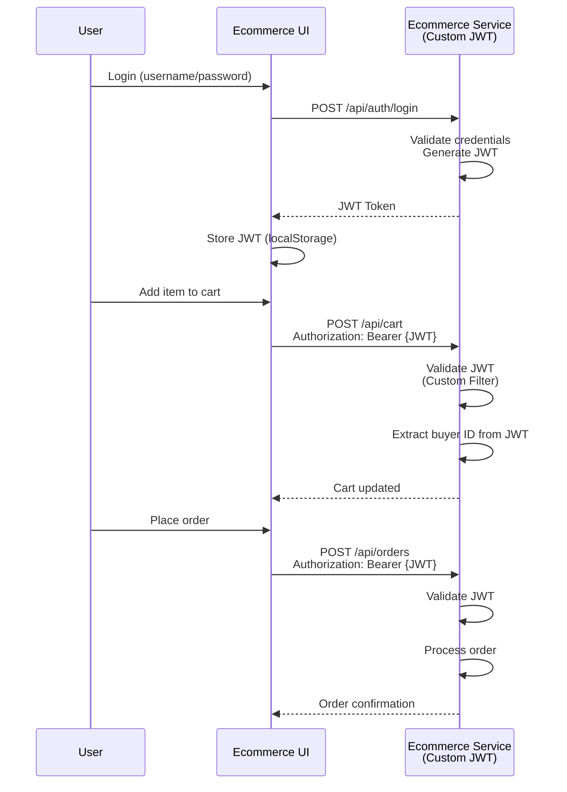

## 11. Recommended Production Architecture (Future State)

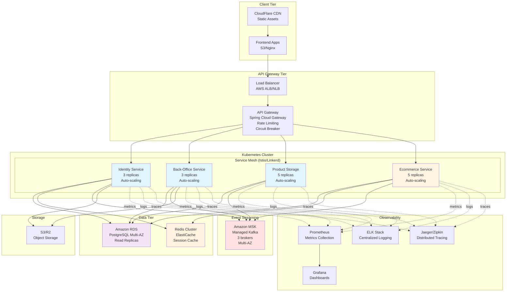

## 12. Technology Stack Overview

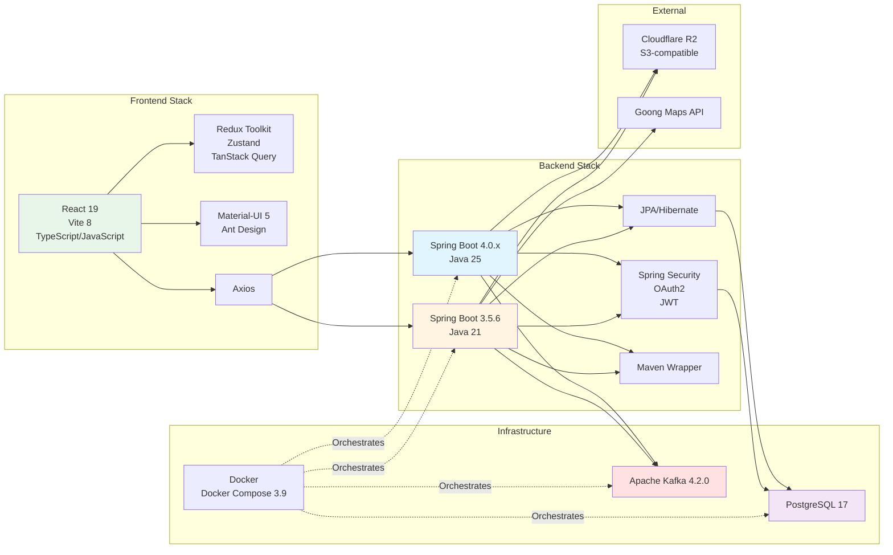

---

## Diagram Legend

- **Blue boxes**: Spring Boot 4.x services (Java 25)
- **Yellow boxes**: Spring Boot 3.x service (Java 21) - Clean Architecture
- **Green boxes**: Frontend applications
- **Red boxes**: Event streaming (Kafka)
- **Purple boxes**: Databases
- **Solid arrows**: Direct calls/dependencies
- **Dashed arrows**: Asynchronous events or monitoring connections
