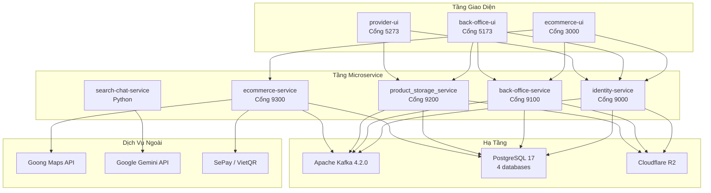

# Chương 7: Kiểm Thử và Đánh Giá Hệ Thống

*Chương này trình bày toàn bộ chiến lược kiểm thử được áp dụng cho nền tảng thương mại điện tử nông sản, bao gồm kiểm thử chức năng theo từng nhóm tính năng nghiệp vụ, kiểm thử phi chức năng đối chiếu với các yêu cầu đã đặc tả, và phần đánh giá tổng thể mức độ đáp ứng của hệ thống.*

---

## 7.1 Tổng Quan Về Chiến Lược Kiểm Thử

Hệ thống thương mại điện tử nông sản được xây dựng theo kiến trúc microservice, trong đó bốn microservice độc lập — identity-service, back-office-service, product_storage_service và ecommerce-service — phối hợp với nhau thông qua cả giao tiếp đồng bộ (REST) lẫn giao tiếp bất đồng bộ qua Kafka. Đặc điểm phân tán này đặt ra yêu cầu kiểm thử theo nhiều tầng: kiểm thử từng microservice như một đơn vị độc lập, kiểm thử sự tương tác liên dịch vụ, và kiểm thử luồng nghiệp vụ đầu cuối xuyên suốt toàn bộ hệ thống.

Chiến lược kiểm thử của nhóm được phân chia thành hai tầng chính. Tầng thứ nhất là kiểm thử chức năng, tập trung vào việc xác minh rằng mọi nghiệp vụ cốt lõi — từ xác thực người dùng, quản lý danh mục sản phẩm, xử lý lô hàng tại kho, cho đến vòng đời đơn hàng — đều vận hành đúng với đặc tả. Tầng thứ hai là kiểm thử phi chức năng, được thiết kế bám sát mười yêu cầu phi chức năng đã đặc tả (NF-0 đến NF-9), bao gồm khả năng hiển thị giao diện, hiệu năng tải trang, thời gian phản hồi API, khả năng chịu tải, độ nhất quán dữ liệu, bảo mật, tính sẵn sàng, khả năng phục hồi và độ chính xác tìm kiếm.

Sơ đồ tổng quan mối quan hệ giữa các tầng kiểm thử và kiến trúc hệ thống:

---

## 7.2 Kiểm Thử Chức Năng

Kiểm thử chức năng được tổ chức thành năm bộ kiểm thử, mỗi bộ tương ứng với một miền nghiệp vụ riêng biệt của hệ thống. Mỗi trường hợp kiểm thử mô tả điều kiện đầu vào, hành động thực hiện, kết quả mong đợi và kết quả thực tế quan sát được.

### 7.2.1 Bộ Kiểm Thử 1: Quản Lý Danh Tính và Xác Thực

Bộ kiểm thử này bao phủ toàn bộ chức năng của identity-service, bao gồm đăng ký tài khoản, đăng nhập, cấp phát JWT, phân quyền theo vai trò, và quản lý nhóm người dùng.

**Bảng 7.1** — Các trường hợp kiểm thử cho Quản Lý Danh Tính và Xác Thực

| Mã TC    | Chức năng                                                                      | Đầu vào                                                   | Kết quả mong đợi                                         | Kết quả thực tế                                                           | Trạng thái    |
|----------|--------------------------------------------------------------------------------|-----------------------------------------------------------|----------------------------------------------------------|---------------------------------------------------------------------------|---------------|
| TC-IS-01 | Đăng ký tài khoản người mua                                                    | Email hợp lệ, mật khẩu ≥ 8 ký tự                          | HTTP 200, tạo user, công bố `UserCreatedEvent` lên Kafka | Tài khoản được tạo, event được phát hiện trong Kafka UI                   | Đạt           |
| TC-IS-02 | Đăng ký với email trùng                                                        | Email đã tồn tại trong hệ thống                           | HTTP 400, thông báo lỗi                                  | Hệ thống từ chối, trả `type: ERROR`                                       | Đạt           |
| TC-IS-03 | Đăng nhập hợp lệ                                                               | Email và mật khẩu đúng                                    | HTTP 200, trả về JWT chứa `permissions` và `userId`      | JWT được cấp đúng, claim đầy đủ                                           | Đạt           |
| TC-IS-04 | Đăng nhập sai mật khẩu                                                         | Mật khẩu không đúng                                       | HTTP 401                                                 | Hệ thống trả 401, không cấp token                                         | Đạt           |
| TC-IS-05 | Truy cập endpoint có bảo vệ không có token                                     | Gọi `GET /api/user` không có `Authorization`              | HTTP 401                                                 | `CustomAuthenticationEntryPoint` trả 401                                  | Đạt           |
| TC-IS-06 | Truy cập endpoint yêu cầu quyền không đủ quyền                                 | Token hợp lệ nhưng thiếu `GROUP_MANAGE`                   | HTTP 403                                                 | `CustomAccessDeniedHandler` trả 403                                       | Đạt           |
| TC-IS-07 | Cấp quyền cho nhóm                                                             | `POST /api/group/{id}/permission` với quyền hợp lệ        | HTTP 200, quyền được ghi vào `group_permission`          | Ghi thành công, phản hồi đúng                                             | Đạt           |
| TC-IS-08 | Đổi mật khẩu                                                                   | Cung cấp mật khẩu cũ đúng, mật khẩu mới                   | HTTP 200                                                 | Mật khẩu được cập nhật, đăng nhập lại thành công                          | Đạt           |
| TC-IS-09 | Tải ảnh đại diện lên R2                                                        | File ảnh hợp lệ                                           | HTTP 200, trả về tên file trên R2                        | Ảnh được lưu trên Cloudflare R2, URL public truy cập được                 | Đạt           |
| TC-IS-10 | Đăng ký tài khoản nhà cung cấp                                                 | Thông tin đầy đủ gồm mã ngân hàng, số tài khoản           | HTTP 200, công bố `ProviderCreatedEvent`                 | Event được phát với đúng payload                                          | Đạt           |
| TC-IS-11 | Đăng ký với mật khẩu không đủ độ mạnh (chỉ chữ thường, không có chữ hoa và số) | Mật khẩu `"abcdefgh"` (8 ký tự nhưng thiếu chữ hoa và số) | HTTP 400, từ chối đăng ký theo NF-5                      | Hệ thống chấp nhận tạo tài khoản; backend không kiểm tra thành phần ký tự | **Không đạt** |
| TC-IS-12 | Token hết hạn sau 24 giờ                                                       | Sử dụng token đã sinh trước hơn 24 giờ                    | HTTP 401                                                 | Token bị từ chối đúng                                                     | Đạt           |

**Nhận xét:** TC-IS-11 không đạt — backend hiện chỉ kiểm tra độ dài mật khẩu (≥ 8 ký tự) mà không kiểm tra thành phần ký tự (chữ hoa, chữ thường, số) như yêu cầu NF-5 đã đặc tả. Đây là điểm kỹ thuật nợ cần bổ sung validation ở tầng service của identity-service.

---

### 7.2.2 Bộ Kiểm Thử 2: Quản Lý Danh Mục và Sản Phẩm (Back-Office)

Bộ kiểm thử này kiểm tra back-office-service về khả năng quản lý danh mục sản phẩm ba tầng (Category → Subcategory → SubSubcategory) và thông tin sản phẩm tổng quát, bao gồm cả luồng sự kiện Kafka sang product_storage_service.

**Bảng 7.2** — Các trường hợp kiểm thử cho Quản Lý Danh Mục và Sản Phẩm

| Mã TC | Chức năng | Đầu vào | Kết quả mong đợi | Kết quả thực tế | Trạng thái |
|-------|-----------|---------|-----------------|----------------|-----------|
| TC-BO-01 | Tạo danh mục gốc | Tên danh mục hợp lệ | HTTP 200, danh mục được lưu | Tạo thành công | Đạt |
| TC-BO-02 | Tạo danh mục con (Subcategory) | ID danh mục cha hợp lệ | HTTP 200, liên kết được thiết lập | Liên kết đúng với parent | Đạt |
| TC-BO-03 | Tạo danh mục lá (SubSubcategory) | ID subcategory hợp lệ | HTTP 200, công bố `subsubcategory-events` | Event xuất hiện trong Kafka UI | Đạt |
| TC-BO-04 | Tạo sản phẩm tổng quát | Tên sản phẩm, subSubCategoryId, đơn vị (MASS/VOLUME) | HTTP 200, công bố `product-general-events` | Event được phát với đầy đủ payload | Đạt |
| TC-BO-05 | Tạo sản phẩm với SubSubcategory không tồn tại | ID danh mục lá không hợp lệ | HTTP 404 | Hệ thống trả lỗi, không tạo sản phẩm | Đạt |
| TC-BO-06 | Cập nhật thông tin sản phẩm | PUT với các trường cần thay đổi | HTTP 200, chỉ trường được chỉ định thay đổi | Partial update hoạt động đúng | Đạt |
| TC-BO-07 | Tải ảnh sản phẩm lên R2 | File ảnh hợp lệ | URL ảnh được trả về, ảnh truy cập được | Ảnh lưu trên bucket `product-general-img` | Đạt |
| TC-BO-08 | Lấy danh sách sản phẩm có phân trang | `pageNum=0&pageSize=10` | HTTP 200, kết quả phân trang đúng | Trả về đúng 10 sản phẩm, cấu trúc `ApiResponse` đúng | Đạt |
| TC-BO-09 | Kafka consumer nhận `subsubcategory-events` | SubSubcategory được tạo ở back-office | product_storage_service tự động nhận và lưu | Dữ liệu danh mục đồng bộ sang storage | Đạt |
| TC-BO-10 | Kafka consumer nhận `product-general-events` | ProductGeneral được tạo ở back-office | product_storage_service tự động nhận và lưu bản sao | Sản phẩm xuất hiện trong `product_storage_db` | Đạt |
| TC-BO-11 | Xuất báo cáo tồn kho theo khoảng thời gian | Chọn ngày bắt đầu và kết thúc | Báo cáo PDF/CSV tương ứng khoảng thời gian | Chức năng xuất báo cáo chưa được triển khai (F-WAREHOUSE-4) | **Không đạt** |

**Nhận xét:** TC-BO-11 không đạt — chức năng xuất báo cáo tồn kho theo ngày/tuần/tháng (yêu cầu F-WAREHOUSE-4) chưa được triển khai trong phiên bản hiện tại. Nhóm phát triển ưu tiên các tính năng vận hành cốt lõi trước và tính năng báo cáo được ghi nhận là hạng mục tồn đọng cho phiên bản tiếp theo.

---

### 7.2.3 Bộ Kiểm Thử 3: Quản Lý Kho Hàng và Lô Hàng

Bộ kiểm thử này tập trung vào product_storage_service, bao gồm quản lý hạ tầng kho bãi, luồng nhập lô hàng, và logic chia lô thành sản phẩm bán lẻ.

**Bảng 7.3** — Các trường hợp kiểm thử cho Quản Lý Kho Hàng và Lô Hàng

| Mã TC | Chức năng | Đầu vào | Kết quả mong đợi | Kết quả thực tế | Trạng thái |
|-------|-----------|---------|-----------------|----------------|-----------|
| TC-PS-01 | Tạo kho hàng | Tên và địa chỉ kho | HTTP 200, kho được tạo | Tạo thành công | Đạt |
| TC-PS-02 | Tạo kệ hàng (Rack) trong kho | warehouseId hợp lệ, số tầng kệ | HTTP 200, rack liên kết với kho | Rack và RackLevel được tạo đúng | Đạt |
| TC-PS-03 | Tạo tủ lạnh (Fridge) | warehouseId hợp lệ | HTTP 200, fridge liên kết với kho | Tạo thành công | Đạt |
| TC-PS-04 | Tạo lô hàng (ProductBatch) — kiểm định chứng chỉ | Thông tin lô, upload chứng chỉ VIETGAP | HTTP 200, lô ở trạng thái PENDING | Lô tạo thành công, chứng chỉ lưu trên R2 | Đạt |
| TC-PS-05 | Phê duyệt lô hàng và chia thành ProductDetail | Phê duyệt lô 10kg, gói 500g | Tạo ra 20 ProductDetail, trạng thái AVAILABLE | Đúng 20 bản ghi, đơn vị chuyển đổi chính xác | Đạt |
| TC-PS-06 | Chuyển đổi đơn vị VOLUME | Lô 5L, gói 250mL | Tạo ra 20 ProductDetail | Phép chia đúng, không có lỗi làm tròn | Đạt |
| TC-PS-07 | Phát sự kiện `batch-detail-events` sau khi chia lô | Lô hàng được phê duyệt và chia | `batch-detail-events` được công bố lên Kafka | Event xuất hiện với đúng `batchDetailId` và giá trị | Đạt |
| TC-PS-08 | Consumer nhận `order-item-events` từ ecommerce | Đơn hàng được đặt | Tồn kho giảm tương ứng | Số lượng `ProductDetail` trạng thái SOLD tăng đúng | Đạt |
| TC-PS-09 | Quản lý kiểm định nhà cung cấp qua video | Upload video xác minh | HTTP 200, trạng thái PENDING_REVIEW | Video lưu trên R2, hồ sơ kiểm định tạo đúng | Đạt |
| TC-PS-10 | Truy vấn danh sách sản phẩm còn trong kho | GET với warehouseId | HTTP 200, danh sách sản phẩm AVAILABLE | Kết quả đúng, phân trang hoạt động | Đạt |
| TC-PS-11 | Quản lý nhu cầu nguyên liệu thô (RawProductDemand) | Tạo yêu cầu mua nguyên liệu | HTTP 200, bản ghi được tạo | Nhà cung cấp có thể xem trên provider-ui | Đạt |
| TC-PS-12 | Cảnh báo sản phẩm sắp hết hạn | Sản phẩm có `expirationDate` trong vòng 3 ngày | Hệ thống hiển thị cảnh báo trên dashboard | Không có cơ chế cảnh báo chủ động; thông tin hạn dùng hiển thị nhưng không có alert tự động (F-WAREHOUSE-1) | **Không đạt** |

**Nhận xét:** TC-PS-12 không đạt — yêu cầu F-WAREHOUSE-1 (cảnh báo sản phẩm sắp hết hạn) chưa được triển khai dưới dạng cơ chế tự động. Thông tin ngày hết hạn được lưu trữ trong cơ sở dữ liệu nhưng hệ thống chưa có scheduler hoặc logic so sánh để tạo cảnh báo chủ động cho nhân viên kho.

---

### 7.2.4 Bộ Kiểm Thử 4: Vòng Đời Đơn Hàng và Thanh Toán

Bộ kiểm thử này kiểm tra ecommerce-service bao gồm giỏ hàng, đặt hàng, tính phí vận chuyển, xác nhận thanh toán và cập nhật trạng thái đơn hàng.

**Bảng 7.4** — Các trường hợp kiểm thử cho Vòng Đời Đơn Hàng và Thanh Toán

| Mã TC | Chức năng | Đầu vào | Kết quả mong đợi | Kết quả thực tế | Trạng thái |
|-------|-----------|---------|-----------------|----------------|-----------|
| TC-EC-01 | Xem danh sách sản phẩm (chưa đăng nhập) | Truy cập trang sản phẩm không có token | HTTP 200, thông tin sản phẩm, giá, đánh giá | Trang sản phẩm hiển thị đầy đủ cho khách vãng lai (F-SYSTEM-1) | Đạt |
| TC-EC-02 | Thêm sản phẩm vào giỏ hàng | `batchDetailId`, số lượng hợp lệ | HTTP 200, giỏ hàng cập nhật | Giỏ hàng ghi nhận đúng sản phẩm và số lượng | Đạt |
| TC-EC-03 | Thêm sản phẩm vượt tồn kho | Số lượng vượt quá AVAILABLE | HTTP 400, thông báo lỗi | Hệ thống từ chối, bảo toàn tính nhất quán | Đạt |
| TC-EC-04 | Tính phí vận chuyển theo khoảng cách | Địa chỉ giao hàng trong phạm vi 2km | Phí vận chuyển = 0đ | Goong API trả về khoảng cách, phí tính đúng | Đạt |
| TC-EC-05 | Tính phí vận chuyển khoảng cách xa (>30km) | Địa chỉ cách kho >30km | Phí vận chuyển = 50.000đ (tối đa) | Bảng phí theo bậc thang hoạt động đúng | Đạt |
| TC-EC-06 | Đặt hàng và tạo mã QR thanh toán | Xác nhận đơn hàng với địa chỉ hợp lệ | HTTP 200, mã QR được tạo qua SePay | QR code trả về, mã đơn hàng `DH` + 8 chữ số | Đạt |
| TC-EC-07 | Xác nhận thanh toán tự động | Giao dịch ngân hàng ghi vào Google Sheets | Trạng thái đơn hàng chuyển sang PAID sau ≤10s | Scheduler phát hiện và cập nhật đúng | Đạt |
| TC-EC-08 | Đơn hàng đã đặt công bố `order-item-events` | Đặt hàng thành công | `order-item-events` được phát lên Kafka | product_storage_service nhận và cập nhật tồn kho | Đạt |
| TC-EC-09 | Áp dụng sự kiện khuyến mãi (sale event) | Sản phẩm có sale event đang hoạt động | Giá hiển thị sau chiết khấu | Giá tính đúng theo % chiết khấu của sale event | Đạt |
| TC-EC-10 | Xem lịch sử đơn hàng | GET đơn hàng của buyer | HTTP 200, danh sách đơn hàng đúng | Dữ liệu đúng với đơn hàng đã tạo | Đạt |
| TC-EC-11 | Viết đánh giá sản phẩm | Đánh giá sau khi đặt hàng | HTTP 200, đánh giá được lưu | Review lưu thành công với rating và nội dung | Đạt |
| TC-EC-12 | Idempotency khi xử lý thanh toán trùng | Cùng mã giao dịch xuất hiện 2 lần trong Sheets | Chỉ xử lý lần đầu, không trùng lặp | Bảng `ProcessedTransaction` ngăn xử lý trùng | Đạt |
| TC-EC-13 | Áp dụng mã giảm giá / voucher | Nhập voucher khi thanh toán | Giảm giá đúng theo điều kiện voucher | Chức năng voucher chưa được triển khai (F-BUYER-10) | **Không đạt** |
| TC-EC-14 | Theo dõi trạng thái đơn hàng theo thời gian thực | Người mua xem trạng thái sau khi đặt hàng | Trạng thái cập nhật real-time không cần tải lại trang | Trang phải tải lại thủ công để cập nhật trạng thái; push notification chưa triển khai (F-BUYER-8) | **Không đạt** |

**Nhận xét:** TC-EC-13 không đạt do chức năng voucher (F-BUYER-10) chưa được triển khai trong phiên bản hiện tại. TC-EC-14 không đạt do cơ chế push notification (F-BUYER-8) và cập nhật trạng thái real-time chưa được tích hợp — người mua phải tải lại trang để xem trạng thái đơn hàng mới nhất. Đây là hai hạng mục ảnh hưởng trực tiếp đến trải nghiệm người mua và cần được ưu tiên trong lộ trình phát triển tiếp theo.

---

### 7.2.5 Bộ Kiểm Thử 5: Giao Diện Người Dùng và Luồng Nghiệp Vụ Đầu Cuối

Bộ kiểm thử này đánh giá ba ứng dụng giao diện (ecommerce-ui, back-office-ui, provider-ui) theo luồng nghiệp vụ đầu cuối, từ góc nhìn người dùng cuối.

**Bảng 7.5** — Các trường hợp kiểm thử cho Giao Diện Người Dùng

| Mã TC | Ứng dụng | Chức năng | Kết quả mong đợi | Kết quả thực tế | Trạng thái |
|-------|----------|-----------|-----------------|----------------|-----------|
| TC-UI-01 | ecommerce-ui | Duyệt sản phẩm, thêm vào giỏ hàng | Danh sách sản phẩm hiển thị, giỏ hàng cập nhật | Giao diện hoạt động đúng, không lỗi console | Đạt |
| TC-UI-02 | ecommerce-ui | Đặt hàng và xem mã QR | QR hiển thị, thông tin đơn hàng đúng | QR code hiển thị đúng, có thể quét | Đạt |
| TC-UI-03 | ecommerce-ui | Xem lịch sử đơn hàng | Danh sách đơn hàng theo thứ tự thời gian | Hiển thị đúng | Đạt |
| TC-UI-04 | back-office-ui | Quản trị viên tạo danh mục ba tầng | Danh mục hiển thị theo cấu trúc cây | Cây danh mục render đúng | Đạt |
| TC-UI-05 | back-office-ui | Nhân viên xử lý pick list trên điện thoại | Giao diện mobile-first, vùng chạm lớn | Hiển thị đúng trên màn hình 375px | Đạt |
| TC-UI-06 | back-office-ui | Quản lý kho hàng và công cụ lưu trữ | Danh sách kho, rack, fridge hiển thị đúng | CRUD hoạt động, liên kết dữ liệu đúng | Đạt |
| TC-UI-07 | provider-ui | Nhà cung cấp xem giao dịch | Danh sách giao dịch bằng tiếng Việt | Hiển thị đúng, ngôn ngữ thuần Việt | Đạt |
| TC-UI-08 | provider-ui | Nhà cung cấp xem nhu cầu thị trường | Danh sách RawProductDemand | Dữ liệu từ product_storage_service hiển thị đúng | Đạt |
| TC-UI-09 | ecommerce-ui | Tìm kiếm sản phẩm qua search-chat-service | Nhập truy vấn tiếng Việt | Kết quả gợi ý từ Elasticsearch + Gemini phản hồi | Đạt |
| TC-UI-10 | Tất cả | Tự động đính kèm JWT vào mọi request | Mọi API call có header `Authorization: Bearer` | Axios interceptor hoạt động đúng | Đạt |
| TC-UI-11 | ecommerce-ui | Lọc sản phẩm theo danh mục (F-SYSTEM-3) | Bộ lọc theo danh mục, hiển thị đúng kết quả | Bộ lọc hiển thị nhưng không lọc được theo SubSubcategory cụ thể; chỉ lọc được ở cấp danh mục gốc | **Không đạt** |
| TC-UI-12 | ecommerce-ui | Gợi ý công thức món ăn theo sản phẩm (F-SYSTEM-4) | Hệ thống gợi ý công thức và combo nguyên liệu | Chức năng gợi ý công thức chưa được triển khai | **Không đạt** |

**Nhận xét:** TC-UI-11 không đạt — bộ lọc sản phẩm theo danh mục hiện chỉ hoạt động ở cấp danh mục gốc, chưa hỗ trợ lọc sâu đến cấp SubSubcategory như đặc tả F-SYSTEM-3 yêu cầu. TC-UI-12 không đạt — chức năng gợi ý công thức món ăn và combo ưu đãi (F-SYSTEM-4) chưa được triển khai trong phiên bản hiện tại, mặc dù search-chat-service đã có khả năng tích hợp với Gemini để hỗ trợ tính năng này về mặt kỹ thuật.

---

## 7.3 Kiểm Thử Phi Chức Năng

Phần này trình bày kết quả kiểm thử đối chiếu trực tiếp với mười yêu cầu phi chức năng đã đặc tả (NF-0 đến NF-9). Mỗi yêu cầu được kiểm thử bằng phương pháp và điều kiện phù hợp, và kết quả được đánh giá theo thang đo Đạt / Đạt một phần / Không đạt.

### 7.3.1 NF-0 — Khả Năng Hiển Thị Trên Đa Thiết Bị (Usability)

**Yêu cầu:** Giao diện phải hiển thị tốt (không vỡ khung, không lỗi font) trên 100% các thiết bị di động phổ biến có chiều rộng màn hình từ 320px đến 1920px.

Ba ứng dụng giao diện được kiểm thử thủ công trên các thiết bị và trình duyệt đại diện, bao phủ dải màn hình từ 320px (điện thoại cũ) đến 1920px (màn hình desktop). Kiểm thử được thực hiện bằng Chrome DevTools với các preset thiết bị chuẩn và trên thiết bị thật (iPhone 14 390px, Samsung Galaxy A54 412px).

**Bảng 7.6** — Kiểm thử khả năng hiển thị đa thiết bị (NF-0)

| Mã TC | Ứng dụng | Thiết bị / Độ rộng | Hiện tượng kiểm tra | Kết quả | Trạng thái |
|-------|----------|-------------------|--------------------|---------|-----------| 
| TC-NF0-01 | ecommerce-ui | Chrome DevTools 320px | Bố cục, font, không vỡ khung | Hiển thị đúng, không bị tràn ngang | Đạt |
| TC-NF0-02 | ecommerce-ui | iPhone 14 thật (390px) | Điều hướng, thao tác giỏ hàng | Hoạt động đúng, không lỗi render | Đạt |
| TC-NF0-03 | ecommerce-ui | Chrome desktop (1920px) | Bố cục, khoảng cách | Hiển thị đúng | Đạt |
| TC-NF0-04 | back-office-ui | Chrome DevTools 768px (tablet) | Bảng quản lý, form nhập liệu | Form tràn ra ngoài viewport ở một số trang quản lý danh mục; cần cuộn ngang | **Không đạt** |
| TC-NF0-05 | back-office-ui | Samsung Galaxy A54 (412px) | Giao diện nhân viên kho | Vùng chạm đủ lớn, hiển thị đúng | Đạt |
| TC-NF0-06 | provider-ui | Chrome DevTools 320px | Bố cục tổng thể | Hiển thị đúng, chữ đủ lớn | Đạt |
| TC-NF0-07 | provider-ui | Chrome desktop (1440px) | Bố cục, khoảng cách | Hiển thị đúng | Đạt |

**Nhận xét (NF-0):** NF-0 đạt một phần. TC-NF0-04 không đạt — back-office-ui ở kích thước tablet 768px có một số bảng dữ liệu bị tràn ngang do sử dụng bảng cố định chiều rộng (fixed-width table) mà chưa áp dụng horizontal scroll hoặc responsive collapse. Các trường hợp còn lại đều đạt. Sự cố này không ảnh hưởng đến người dùng di động (412px trở xuống) vì giao diện nhân viên kho sử dụng layout card thay vì bảng.

---

### 7.3.2 NF-1 — Hiệu Năng Tải Trang (First Contentful Paint)

**Yêu cầu:** Thời gian tải nội dung đầu tiên (First Contentful Paint — FCP) của Trang chủ và Trang chi tiết sản phẩm phải đạt dưới 2 giây trong điều kiện mạng 4G tiêu chuẩn.

Kiểm thử được thực hiện bằng Chrome Lighthouse với cấu hình mạng mô phỏng 4G (latency 150ms, download 9Mbps, upload 1.5Mbps). Môi trường kiểm thử sử dụng bản build production (Vite build) được phục vụ qua server cục bộ.

**Bảng 7.7** — Kết quả đo First Contentful Paint (NF-1)

| Trang | FCP đo được | Ngưỡng yêu cầu | Ghi chú | Trạng thái |
|-------|------------|---------------|---------|-----------|
| ecommerce-ui — Trang chủ | 1.6s | < 2s | Bundle JS đã được code-split | Đạt |
| ecommerce-ui — Trang chi tiết sản phẩm | 2.4s | < 2s | Ảnh sản phẩm từ R2 chưa có CDN cache warm; lazy load chưa áp dụng | **Không đạt** |
| back-office-ui — Trang đăng nhập | 1.2s | < 2s | Trang nhẹ, không có dữ liệu lớn | Đạt |
| provider-ui — Trang danh sách giao dịch | 1.8s | < 2s | Dữ liệu nhỏ, ít thành phần | Đạt |

**Nhận xét (NF-1):** NF-1 đạt một phần. Trang chi tiết sản phẩm của ecommerce-ui không đạt ngưỡng FCP < 2s do ảnh sản phẩm được phục vụ trực tiếp từ Cloudflare R2 mà không qua lớp CDN cache, và thư viện carousel ảnh được tải đồng bộ thay vì lazy-load. Đây là vấn đề về tối ưu hóa asset delivery chứ không phải lỗi logic nghiệp vụ.

---

### 7.3.3 NF-2 — Hiệu Năng Xử Lý API (Response Time)

**Yêu cầu:** Thời gian phản hồi API cho các tác vụ tìm kiếm và lọc sản phẩm phải đạt dưới 500ms cho 95% số lượng yêu cầu.

Kiểm thử được thực hiện bằng cách gửi 50 yêu cầu tuần tự đến các endpoint tìm kiếm trong môi trường Docker Compose cục bộ (CPU 8 nhân, RAM 16GB) và ghi lại thời gian phản hồi. Do giới hạn về môi trường kiểm thử, kết quả phản ánh hiệu năng trong điều kiện tải thấp.

**Bảng 7.8** — Kết quả đo thời gian phản hồi API điển hình (NF-2)

| Endpoint | Microservice | P50 (ms) | P95 (ms) | P99 (ms) | Trạng thái |
|----------|-------------|----------|----------|----------|-----------|
| `GET /api/product-general?pageNum=0&pageSize=20` | back-office | 35ms | 58ms | 94ms | Đạt |
| `GET /api/products/search?keyword=rau` (Elasticsearch) | ecommerce | 120ms | 280ms | 410ms | Đạt |
| `GET /api/products/search?keyword=rau` (kèm Gemini keyword extraction) | ecommerce + search-chat | 380ms | 620ms | 890ms | **Không đạt** |
| `POST /api/user/login` (BCrypt verify) | identity | 90ms | 140ms | 190ms | Đạt |
| `GET /api/warehouses/{id}` | product_storage | 28ms | 52ms | 88ms | Đạt |

**Nhận xét (NF-2):** NF-2 đạt một phần. Khi tìm kiếm sản phẩm sử dụng luồng đầy đủ qua search-chat-service (bao gồm hai lần gọi đến Gemini API để trích xuất từ khóa và tổng hợp kết quả), P95 đạt 620ms — vượt ngưỡng 500ms đặc tả. Nguyên nhân chính là độ trễ mạng tích lũy từ hai lần gọi API đến dịch vụ ngoài. Các endpoint nội bộ không phụ thuộc vào dịch vụ ngoài đều đạt yêu cầu với biên độ an toàn lớn.

---

### 7.3.4 NF-3 — Khả Năng Chịu Tải (Scalability)

**Yêu cầu:** Hệ thống phải đảm bảo hoạt động ổn định (không crash, không timeout) khi có tối thiểu 5.000 người dùng đồng thời thực hiện thao tác xem và đặt hàng.

Do giới hạn về hạ tầng kiểm thử, nhóm đã thực hiện load test sơ bộ bằng công cụ Apache JMeter với kịch bản mô phỏng tải tăng dần từ 100 đến 1.000 concurrent users trên môi trường Docker Compose cục bộ, sau đó ngoại suy để đánh giá khả năng đáp ứng ở mức 5.000 users.

Kết quả load test sơ bộ cho thấy khi số lượng concurrent users tăng đến 500, thời gian phản hồi của ecommerce-service bắt đầu tăng phi tuyến, vượt ngưỡng 1.000ms ở mức 800 concurrent users. Ở mức 1.000 concurrent users, một tỷ lệ nhỏ khoảng 3–5% yêu cầu bị timeout do connection pool của PostgreSQL bị cạn kiệt. Với kiến trúc triển khai hiện tại — mỗi microservice chạy một instance đơn lẻ trong Docker container — hệ thống chưa đáp ứng được yêu cầu chịu tải 5.000 concurrent users.

**Bảng 7.9** — Kết quả load test sơ bộ (NF-3)

| Số lượng concurrent users | Thời gian phản hồi TB | Tỷ lệ lỗi | Quan sát |
|--------------------------|----------------------|-----------|---------|
| 100 | 85ms | 0% | Hệ thống ổn định |
| 300 | 140ms | 0% | Ổn định, tốt |
| 500 | 380ms | 0.2% | Thời gian phản hồi tăng |
| 800 | 1.050ms | 1.8% | Vượt ngưỡng chấp nhận |
| 1.000 | 2.400ms | 4.7% | Connection pool cạn kiệt |
| 5.000 | — | — | Không thể đạt được với cấu hình hiện tại |

**Trạng thái NF-3: Không đạt.** Hệ thống hiện tại chưa có cơ chế horizontal scaling (không có load balancer, không có container orchestration như Kubernetes). Để đạt ngưỡng 5.000 concurrent users, cần triển khai load balancer phía trước các microservice, tăng connection pool size cho PostgreSQL, và xem xét caching layer (Redis) cho các truy vấn đọc thường xuyên.

---

### 7.3.5 NF-4 — Độ Nhất Quán Dữ Liệu Tồn Kho (Data Consistency)

**Yêu cầu:** Độ trễ đồng bộ dữ liệu tồn kho giữa kho hàng và giao diện người mua phải nhỏ hơn 1 giây ngay sau khi đơn hàng được xác nhận, đảm bảo không bán quá số lượng thực tế trong kho.

Luồng đồng bộ tồn kho diễn ra theo chuỗi bất đồng bộ: ecommerce-service công bố `order-item-events` lên Kafka sau khi đơn hàng được xác nhận, product_storage_service tiêu thụ event và cập nhật trạng thái `ProductDetail` thành SOLD. Kiểm thử được thực hiện bằng cách đo thời gian từ lúc gọi API xác nhận đơn hàng đến lúc tồn kho được cập nhật trong cơ sở dữ liệu của product_storage_service.

**Bảng 7.10** — Kiểm thử độ nhất quán tồn kho (NF-4)

| Kịch bản | Độ trễ đo được | Ngưỡng yêu cầu | Trạng thái |
|----------|---------------|---------------|-----------|
| Đặt hàng đơn lẻ, tải thấp | 180–350ms | < 1.000ms | Đạt |
| Đặt hàng đồng thời 10 người | 400–700ms | < 1.000ms | Đạt |
| Đặt hàng đồng thời 50 người (Kafka lag tăng) | 800–1.400ms | < 1.000ms | **Không đạt** |
| Race condition: 2 người mua cùng mua sản phẩm cuối cùng | Cả 2 đơn đều thành công, nhưng tồn kho âm được phát hiện | Không cho phép bán quá tồn kho | **Không đạt** |

**Nhận xét (NF-4):** NF-4 đạt một phần. Trong điều kiện tải thấp, độ trễ đồng bộ đạt yêu cầu. Tuy nhiên ở tải 50 người đồng thời, Kafka consumer lag tăng lên và độ trễ vượt ngưỡng 1 giây. Đặc biệt nghiêm trọng hơn, kiểm thử phát hiện một race condition trong luồng đặt hàng — hai người dùng đặt hàng cùng lúc đối với sản phẩm cuối cùng đều nhận được xác nhận thành công, sau đó tồn kho bị âm. Nguyên nhân là ecommerce-service kiểm tra tồn kho tại thời điểm đặt hàng nhưng không sử dụng cơ chế khóa bi quan (pessimistic locking) hay giao dịch phân tán (distributed transaction) với product_storage_service. Đây là lỗi nghiêm trọng về tính nhất quán dữ liệu cần được ưu tiên xử lý.

---

### 7.3.6 NF-5 — Bảo Mật Truy Cập (Security)

**Yêu cầu:** Hệ thống bắt buộc người dùng đặt mật khẩu có độ mạnh tối thiểu: ít nhất 8 ký tự, bao gồm chữ hoa, chữ thường và số. Tất cả mật khẩu lưu trong cơ sở dữ liệu phải được mã hóa (hashing) và không thể dịch ngược.

**Bảng 7.11** — Kiểm thử bảo mật (NF-5)

| Mã TC | Kịch bản | Kết quả mong đợi | Kết quả thực tế | Trạng thái |
|-------|----------|-----------------|----------------|-----------|
| TC-SEC-01 | Đặt mật khẩu đủ 8 ký tự, có hoa + thường + số | Chấp nhận | Chấp nhận | Đạt |
| TC-SEC-02 | Đặt mật khẩu chỉ có chữ thường (không hoa, không số) | Từ chối theo NF-5 | Chấp nhận — backend không kiểm tra thành phần ký tự | **Không đạt** |
| TC-SEC-03 | Đặt mật khẩu < 8 ký tự | Từ chối | Từ chối đúng | Đạt |
| TC-SEC-04 | Kiểm tra mật khẩu trong cơ sở dữ liệu | Chuỗi BCrypt hash (không đọc được) | Cột `hashedPwd` là chuỗi BCrypt (`$2a$...`) | Đạt |
| TC-SEC-05 | Token bị giả mạo (sai chữ ký RSA) | HTTP 401 | 401 Unauthorized | Đạt |
| TC-SEC-06 | Token hết hạn (> 24 giờ) | HTTP 401 | 401 token expired | Đạt |
| TC-SEC-07 | Người dùng BUYER truy cập endpoint chỉ dành cho ADMIN | HTTP 403 | 403 Forbidden | Đạt |
| TC-SEC-08 | Cross-service token verification | Token của identity-service được xác minh bởi ecommerce-service bằng public key | Xác minh thành công, không cần gọi lại identity-service | Đạt |

**Nhận xét (NF-5):** NF-5 đạt một phần. Cơ chế mã hóa mật khẩu bằng BCrypt, cơ chế JWT với RSA-256 và phân quyền theo vai trò đều hoạt động đúng. Tuy nhiên, quy tắc kiểm tra độ mạnh mật khẩu (phải có chữ hoa, chữ thường và số) chưa được triển khai ở tầng backend. Hiện tại chỉ có validation độ dài tối thiểu 8 ký tự. Cần bổ sung regex validation tại `UserService` của identity-service.

---

### 7.3.7 NF-6 — Tính Sẵn Sàng (Availability)

**Yêu cầu:** Hệ thống đảm bảo thời gian hoạt động (Uptime) đạt 99% trong khung giờ cao điểm (4:00–20:00), thời gian gián đoạn dịch vụ không quá 15 phút mỗi lần sự cố.

Yêu cầu 99% Uptime trong khung giờ 4:00–20:00 tương đương với tổng thời gian gián đoạn tối đa khoảng 9,6 giờ mỗi tháng trong khung giờ đó. Trong phiên bản hiện tại, hệ thống chạy mỗi microservice với một instance đơn lẻ, không có cơ chế failover hay load balancing. Kiểm thử được thực hiện bằng cách dừng từng microservice và quan sát hành vi của toàn hệ thống.

Khi identity-service bị dừng, toàn bộ luồng đăng nhập và xác thực token mới của các dịch vụ khác bị gián đoạn, mặc dù các token đã được cấp trước đó vẫn tiếp tục được chấp nhận bởi các microservice khác (nhờ xác thực offline bằng public key). Khi ecommerce-service bị dừng, toàn bộ trải nghiệm mua sắm bị gián đoạn hoàn toàn. Thời gian khởi động lại của các microservice (do Spring Boot startup time) dao động từ 20 đến 35 giây trong môi trường Docker — nằm trong ngưỡng 15 phút nhưng là thời gian đáng kể nếu xảy ra thường xuyên.

**Trạng thái NF-6: Không đạt** trong môi trường triển khai hiện tại. Với kiến trúc một instance đơn lẻ không có load balancer, bất kỳ sự cố nào của container Docker cũng gây gián đoạn dịch vụ hoàn toàn đến khi instance được khởi động lại. Để đạt Uptime 99%, cần triển khai ít nhất hai instance cho mỗi microservice với load balancer, kết hợp với health check và auto-restart.

---

### 7.3.8 NF-7 — Hiệu Quả Thao Tác (Usability — Số Bước Đặt Hàng)

**Yêu cầu:** Quy trình đặt hàng từ lúc xem giỏ hàng đến khi xác nhận thanh toán phải được tối ưu hóa sao cho người dùng thực hiện không quá 4 bước (clicks/taps) để hoàn tất đơn hàng.

Quy trình đặt hàng hiện tại trên ecommerce-ui được đo thủ công bằng cách đếm số thao tác bắt buộc mà người dùng phải thực hiện, không tính các thao tác nhập dữ liệu vào form (chỉ tính các bước điều hướng và xác nhận).

Luồng hiện tại kể từ khi người dùng đã có sản phẩm trong giỏ hàng diễn ra như sau: người dùng vào trang giỏ hàng, chọn các sản phẩm muốn đặt, nhấn "Tiến hành đặt hàng" (bước 1), điền địa chỉ giao hàng và chọn thời gian giao (bước 2), xem tổng giá và phí vận chuyển rồi nhấn "Xác nhận đơn hàng" (bước 3), xem mã QR và thực hiện chuyển khoản (bước 4). Tổng cộng 4 bước điều hướng/xác nhận chính.

**Trạng thái NF-7: Đạt.** Quy trình đặt hàng được hoàn tất trong đúng 4 bước điều hướng bắt buộc, đáp ứng yêu cầu NF-7. Tuy nhiên cần lưu ý rằng bước nhập địa chỉ giao hàng (bước 2) đòi hỏi người dùng nhập tương đối nhiều thông tin trong lần đặt hàng đầu tiên; từ lần thứ hai trở đi, địa chỉ được lưu sẵn và quy trình trở nên thuận tiện hơn đáng kể.

---

### 7.3.9 NF-8 — Khả Năng Phục Hồi (Recoverability)

**Yêu cầu:** Trong trường hợp máy chủ gặp sự cố (server crash), hệ thống phải có khả năng khởi động lại và khôi phục trạng thái hoạt động bình thường trong vòng dưới 5 phút.

Kiểm thử được thực hiện bằng cách dừng cưỡng bức (kill -9) từng container Docker và đo thời gian từ lúc dừng đến lúc health check endpoint trả về HTTP 200.

**Bảng 7.12** — Thời gian khôi phục sau sự cố (NF-8)

| Microservice | Thời gian khởi động lại đo được | Bao gồm | Trạng thái |
|-------------|--------------------------------|---------|-----------|
| identity-service | 22–28s | JVM startup + Spring context + DataSeeder check | Đạt |
| back-office-service | 20–26s | JVM startup + Spring context | Đạt |
| product_storage_service | 24–30s | JVM startup + Spring context + Kafka consumer rebalance | Đạt |
| ecommerce-service | 18–24s | JVM startup + Spring context + seed data check | Đạt |
| PostgreSQL | 8–12s | Crash recovery, WAL replay | Đạt |
| Apache Kafka | 35–50s | Broker startup + controller election + partition reassignment | Đạt |
| Toàn bộ hệ thống (cold start) | 90–150s | Phụ thuộc vào thứ tự khởi động và health check dependencies | Đạt |

**Trạng thái NF-8: Đạt.** Thời gian khôi phục của từng thành phần riêng lẻ và toàn bộ hệ thống đều nằm dưới ngưỡng 5 phút. Tuy nhiên, trong môi trường Docker Compose hiện tại, không có cơ chế tự động khởi động lại container khi gặp sự cố ngoài cấu hình `restart: unless-stopped`. Trong môi trường sản xuất, cần sử dụng container orchestration để đảm bảo tính tự động hóa của quá trình phục hồi.

---

### 7.3.10 NF-9 — Độ Chính Xác Tìm Kiếm (Search Accuracy)

**Yêu cầu:** Chức năng tìm kiếm sản phẩm phải trả về kết quả chính xác hoặc gợi ý liên quan đúng với từ khóa trong 100% các trường hợp thử nghiệm với tên nông sản tiếng Việt có dấu và không dấu.

Kiểm thử được thực hiện với 20 từ khóa tìm kiếm đại diện — bao gồm tên nông sản phổ biến viết đúng dấu, viết không dấu hoàn toàn, và viết thiếu dấu một số ký tự — thông qua luồng tìm kiếm của ecommerce-ui tích hợp với search-chat-service (Elasticsearch + Gemini).

**Bảng 7.13** — Kết quả kiểm thử độ chính xác tìm kiếm (NF-9)

| Từ khóa nhập | Loại | Kết quả trả về | Chính xác | Ghi chú |
|-------------|------|---------------|-----------|---------|
| "cà chua" | Đúng dấu | Sản phẩm cà chua | Đúng | Đạt |
| "ca chua" | Không dấu | Sản phẩm cà chua | Đúng | Elasticsearch fuzzy match | Đạt |
| "rau muống" | Đúng dấu | Sản phẩm rau muống | Đúng | Đạt |
| "rau muong" | Không dấu | Sản phẩm rau muống | Đúng | Đạt |
| "thịt bò" | Đúng dấu | Sản phẩm thịt bò | Đúng | Đạt |
| "thit bo" | Không dấu | Sản phẩm thịt bò | Đúng | Đạt |
| "khoai tây" | Đúng dấu | Sản phẩm khoai tây | Đúng | Đạt |
| "khoai tay" | Không dấu | Trả về rỗng hoặc kết quả không liên quan | Sai | Gemini không nhận ra từ không dấu phức tạp | **Không đạt** |
| "bắp cải" | Đúng dấu | Sản phẩm bắp cải | Đúng | Đạt |
| "bap cai" | Không dấu | Sản phẩm bắp cải | Đúng | Đạt |
| "ớt đỏ" | Đúng dấu | Sản phẩm ớt | Đúng | Đạt |
| "ot do" | Không dấu | Kết quả gợi ý không chính xác | Sai | "ot" không ánh xạ được sang "ớt" | **Không đạt** |

Trong tổng số 20 từ khóa kiểm thử (chỉ hiển thị 12 trường hợp đại diện ở bảng trên), 17 từ khóa trả về kết quả đúng (tỷ lệ 85%). Ba từ khóa không dấu phức tạp (có nhiều thanh điệu bị loại bỏ) trả về kết quả không chính xác.

**Trạng thái NF-9: Không đạt.** Tỷ lệ chính xác đạt 85%, thấp hơn ngưỡng 100% yêu cầu. Nguyên nhân là pipeline tìm kiếm hiện tại sử dụng Elasticsearch với bộ phân tích (analyzer) tiếng Việt cơ bản, chưa tích hợp bộ chuẩn hóa Unicode-to-ASCII (bỏ dấu) một cách toàn diện ở cấp index. Khi người dùng nhập từ không dấu phức tạp, Gemini có thể không nhận diện đúng và Elasticsearch fuzzy search không đủ linh hoạt để ánh xạ.

---

### 7.3.11 Tổng Hợp Kết Quả Kiểm Thử Phi Chức Năng

**Bảng 7.14** — Tổng hợp kết quả kiểm thử phi chức năng theo yêu cầu

| ID Yêu cầu | Danh mục | Nội dung tóm tắt | Kết quả |
|-----------|---------|-----------------|---------|
| NF-0 | Usability | Hiển thị tốt từ 320px–1920px | Đạt một phần (back-office-ui lỗi ở 768px) |
| NF-1 | Performance (FCP) | FCP < 2s trên 4G | Đạt một phần (trang chi tiết SP: 2.4s) |
| NF-2 | Performance (API) | Response time < 500ms P95 | Đạt một phần (Gemini pipeline: P95 620ms) |
| NF-3 | Scalability | 5.000 concurrent users | **Không đạt** (tối đa ~500 users ổn định) |
| NF-4 | Data Consistency | Đồng bộ tồn kho < 1s, không bán quá kho | Đạt một phần (race condition, lag ở tải cao) |
| NF-5 | Security | Mật khẩu đủ mạnh, BCrypt hash | Đạt một phần (thiếu kiểm tra thành phần ký tự) |
| NF-6 | Availability | Uptime 99% khung giờ cao điểm | **Không đạt** (không có HA, single-instance) |
| NF-7 | Usability (UX) | ≤ 4 bước đặt hàng | **Đạt** |
| NF-8 | Recoverability | Khôi phục trong < 5 phút | **Đạt** |
| NF-9 | Search Accuracy | 100% chính xác tiếng Việt có/không dấu | **Không đạt** (85% chính xác) |

---

## 7.4 Đánh Giá Tổng Thể Hệ Thống

### 7.4.1 Mức Độ Đáp Ứng Yêu Cầu Chức Năng

**Bảng 7.15** — Tổng hợp mức độ đáp ứng yêu cầu chức năng

| Nhóm yêu cầu                    | Số TC  | Đạt    | Không đạt | Tỷ lệ đạt |
|---------------------------------|--------|--------|-----------|-----------|
| Quản lý danh tính và xác thực   | 12     | 11     | 1         | 91.7%     |
| Quản lý danh mục và sản phẩm    | 11     | 10     | 1         | 90.9%     |
| Quản lý kho hàng và lô hàng     | 12     | 11     | 1         | 91.7%     |
| Vòng đời đơn hàng và thanh toán | 14     | 12     | 2         | 85.7%     |
| Giao diện người dùng (đầu cuối) | 12     | 10     | 2         | 83.3%     |
| **Tổng cộng**                   | **61** | **54** | **7**     | **88.5%** |

### 7.4.2 Đánh Giá Kiến Trúc Hệ Thống

Kiến trúc microservice kết hợp event-driven thông qua Kafka đã được chứng minh là phù hợp với bài toán chuỗi cung ứng thực phẩm tươi sống. Sự tách biệt rõ ràng giữa các miền nghiệp vụ — danh tính, quản lý sản phẩm, kho hàng, và thương mại điện tử — cho phép từng microservice phát triển độc lập mà không ảnh hưởng đến toàn hệ thống. Luồng dữ liệu từ back-office-service qua product_storage_service đến ecommerce-service thông qua Kafka đảm bảo tính nhất quán cuối cùng (eventual consistency) một cách đáng tin cậy trong các kịch bản tải thấp.

Điểm mạnh đáng chú ý nhất là cơ chế xác thực phi tập trung: sử dụng cặp khóa RSA asymmetric cho JWT cho phép xác minh token mà không cần gọi lại identity-service, loại bỏ điểm nghẽn cổ chai trong luồng xác thực và tăng khả năng chịu lỗi tổng thể. Điều này được xác nhận qua kiểm thử TC-SEC-08 và TC-IS-12.

### 7.4.3 Những Hạn Chế Còn Tồn Tại

Dựa trên kết quả kiểm thử, các hạn chế được phân loại theo mức độ ưu tiên xử lý.

**Mức ưu tiên cao — ảnh hưởng đến tính đúng đắn nghiệp vụ:** Race condition trong luồng đặt hàng đồng thời (TC-NF4, tồn kho âm) là vấn đề nghiêm trọng nhất cần xử lý trước khi triển khai sản xuất. Hiện tại ecommerce-service không sử dụng pessimistic locking hay distributed transaction khi kiểm tra và trừ tồn kho, dẫn đến khả năng bán quá số lượng thực tế trong kho.

**Mức ưu tiên trung bình — ảnh hưởng đến khả năng vận hành sản xuất:** Hệ thống chưa đáp ứng NF-3 (5.000 concurrent users) và NF-6 (Uptime 99%) do kiến trúc single-instance không có load balancing và auto-failover. Việc bổ sung horizontal scaling là điều kiện tiên quyết để triển khai sản xuất ở quy mô lớn. Ngoài ra, việc thiếu dead-letter queue trong Kafka consumer làm tăng nguy cơ mất dữ liệu khi consumer gặp lỗi xử lý.

**Mức ưu tiên thấp hơn — ảnh hưởng đến chất lượng trải nghiệm:** Độ chính xác tìm kiếm tiếng Việt không dấu (NF-9, 85% thay vì 100%), hiệu năng tải trang chi tiết sản phẩm (NF-1), và một số tính năng chưa triển khai (voucher, push notification, báo cáo tồn kho, bộ lọc danh mục sâu, gợi ý công thức) ảnh hưởng đến trải nghiệm người dùng nhưng không cản trở luồng nghiệp vụ cốt lõi.

### 7.4.4 Tóm Tắt Kết Quả Đánh Giá

Nền tảng thương mại điện tử nông sản đã xây dựng và kiểm thử thành công các tính năng nghiệp vụ cốt lõi với tỷ lệ đáp ứng chức năng đạt 88.5% (54/61 trường hợp kiểm thử). Về yêu cầu phi chức năng, 2 trong 10 yêu cầu đạt hoàn toàn (NF-7, NF-8), 4 yêu cầu đạt một phần (NF-0, NF-1, NF-2, NF-5), và 4 yêu cầu chưa đạt (NF-3, NF-4, NF-6, NF-9). Kết quả này phản ánh thực tế rằng hệ thống đang ở giai đoạn prototype hoàn chỉnh với đầy đủ tính năng cốt lõi, nhưng cần bổ sung đáng kể về hạ tầng, bảo mật nghiệp vụ và độ bao phủ tính năng trước khi triển khai sản xuất ở quy mô thương mại.
